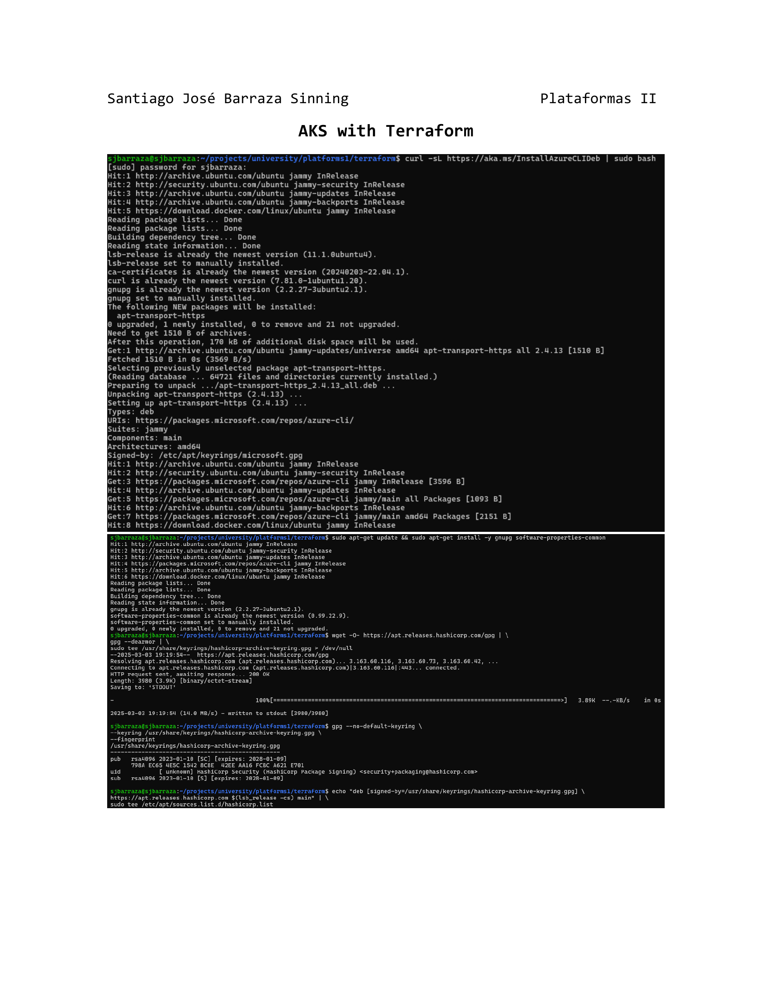
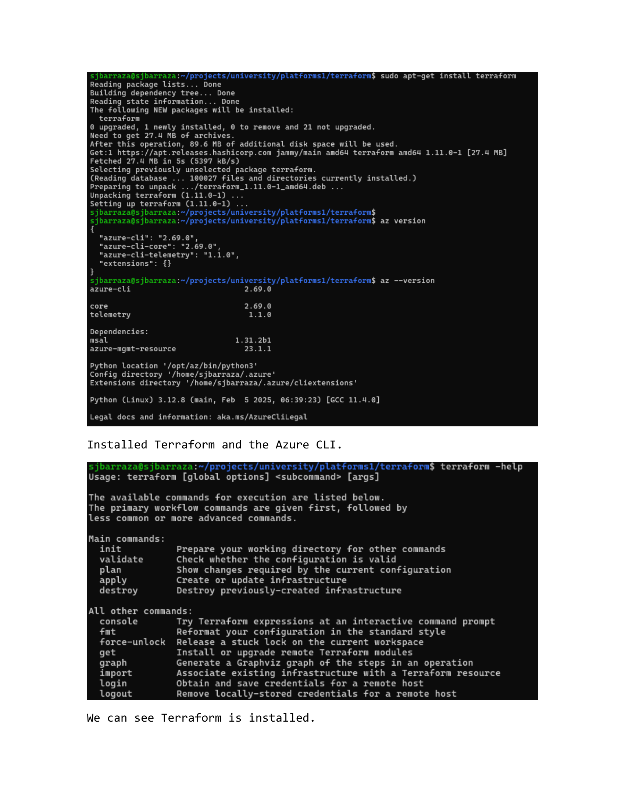
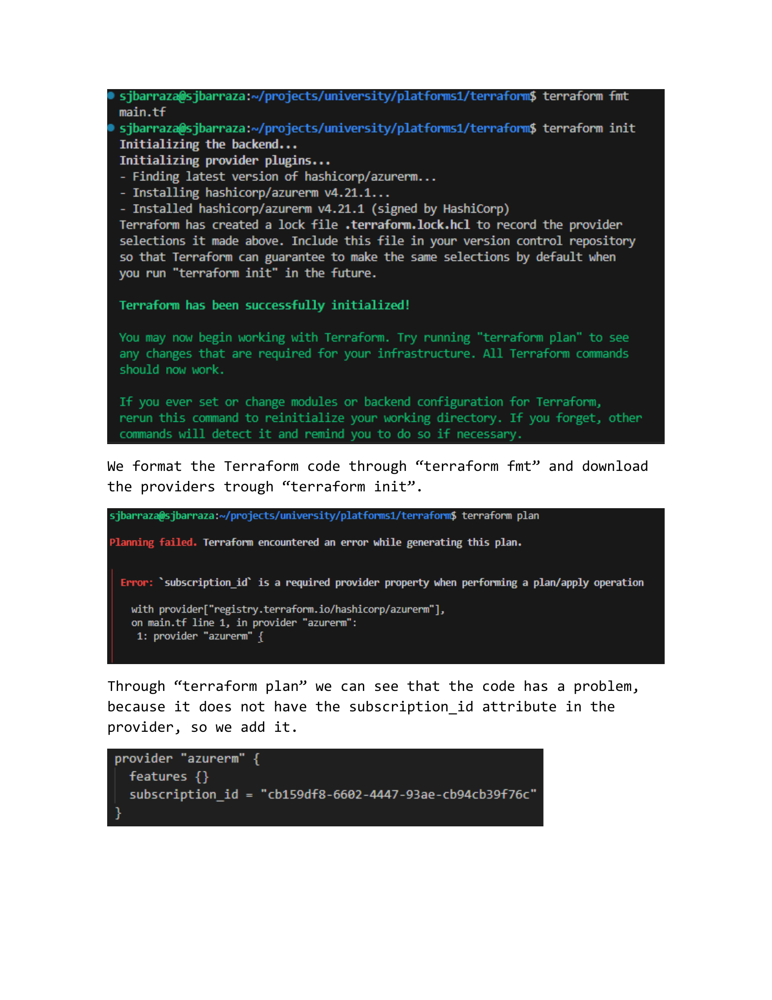
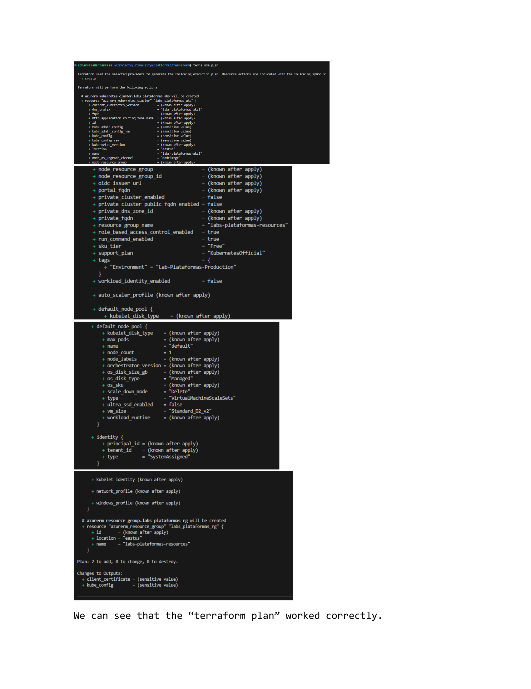
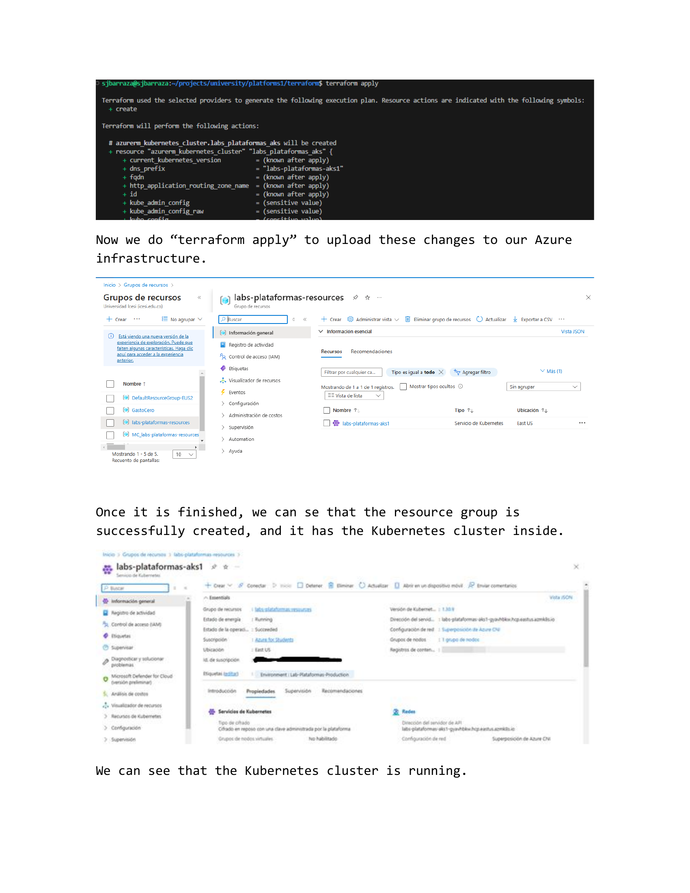
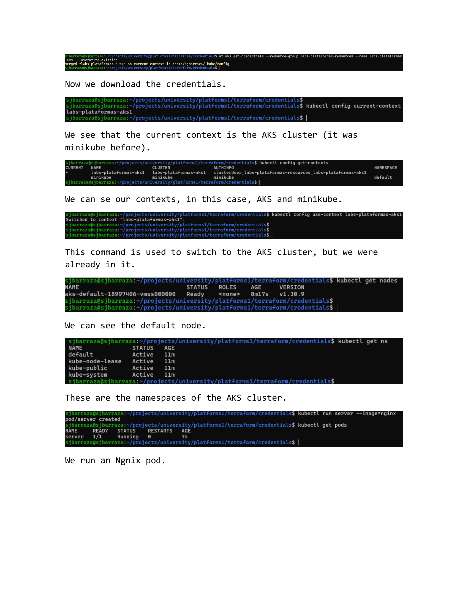
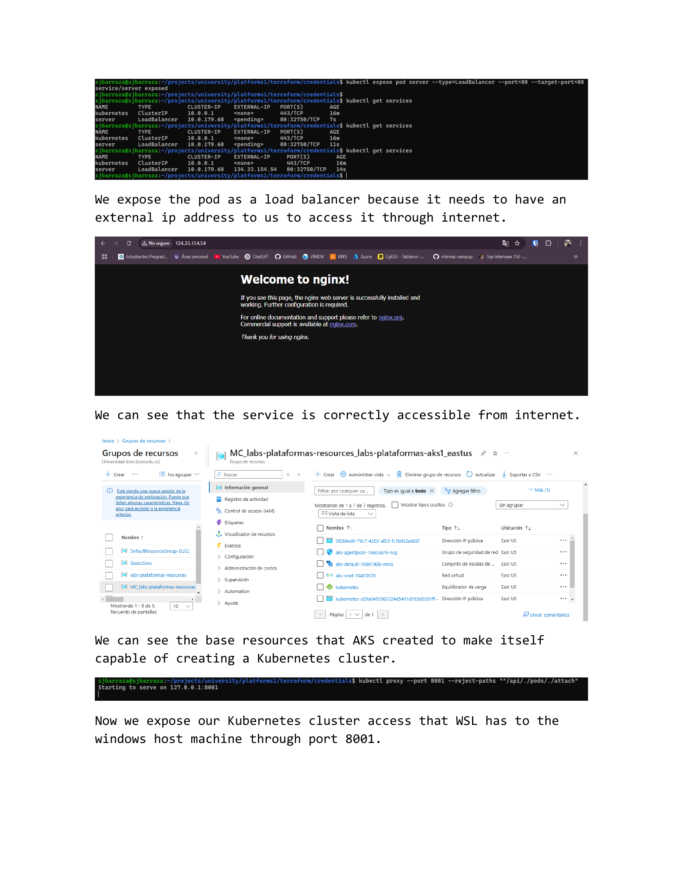
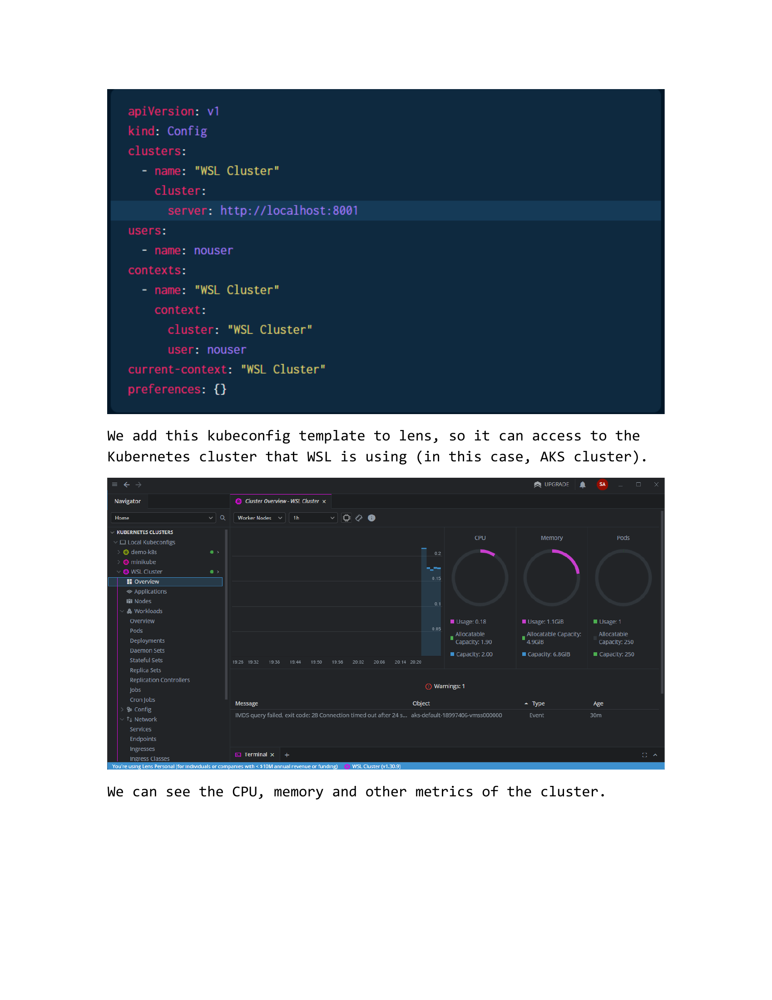
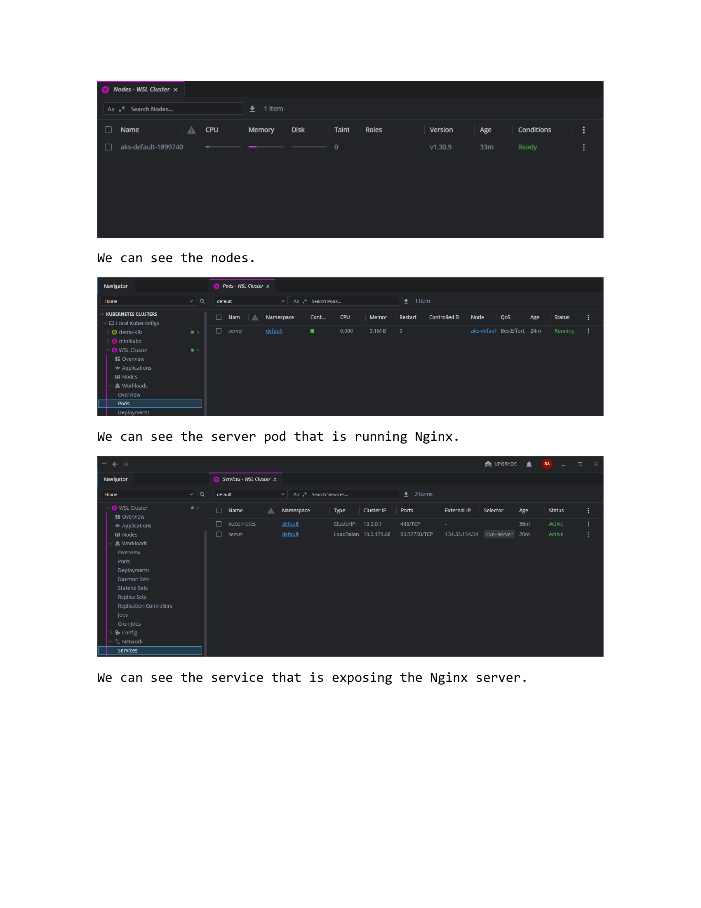
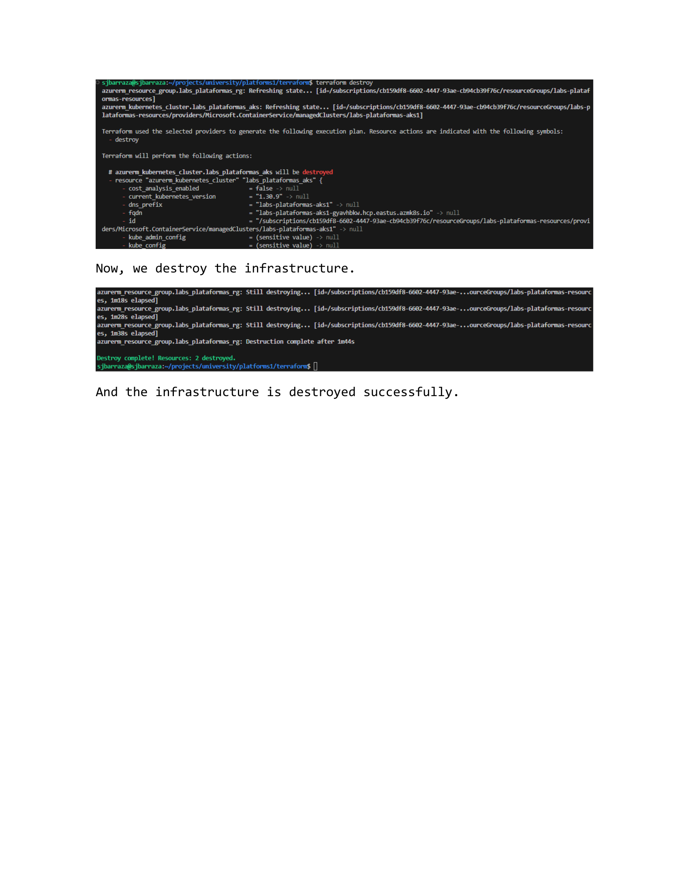

## Page 1

Santiago José Barraza Sinning Plataformas II
AKS with Terraform

## Page 2

Installed Terraform and the Azure CLI.
We can see Terraform is installed.

## Page 3

It is in the 1.11.0 version.
We login into the Azure CLI.
We created a main.tf file for an AKS cluster in Terraform.

## Page 4

We format the Terraform code through “terraform fmt” and download
the providers trough “terraform init”.
Through “terraform plan” we can see that the code has a problem,
because it does not have the subscription_id attribute in the
provider, so we add it.

## Page 5

We can see that the “terraform plan” worked correctly.

## Page 6

Now we do “terraform apply” to upload these changes to our Azure
infrastructure.
Once it is finished, we can se that the resource group is
successfully created, and it has the Kubernetes cluster inside.
We can see that the Kubernetes cluster is running.

## Page 7

Now we download the credentials.
We see that the current context is the AKS cluster (it was
minikube before).
We can se our contexts, in this case, AKS and minikube.
This command is used to switch to the AKS cluster, but we were
already in it.
We can see the default node.
These are the namespaces of the AKS cluster.
We run an Ngnix pod.

## Page 8

We expose the pod as a load balancer because it needs to have an
external ip address to us to access it through internet.
We can see that the service is correctly accessible from internet.
We can see the base resources that AKS created to make itself
capable of creating a Kubernetes cluster.
Now we expose our Kubernetes cluster access that WSL has to the
windows host machine through port 8001.

## Page 9

We add this kubeconfig template to lens, so it can access to the
Kubernetes cluster that WSL is using (in this case, AKS cluster).
We can see the CPU, memory and other metrics of the cluster.

## Page 10

We can see the nodes.
We can see the server pod that is running Nginx.
We can see the service that is exposing the Nginx server.

## Page 11

Now, we destroy the infrastructure.
And the infrastructure is destroyed successfully.

